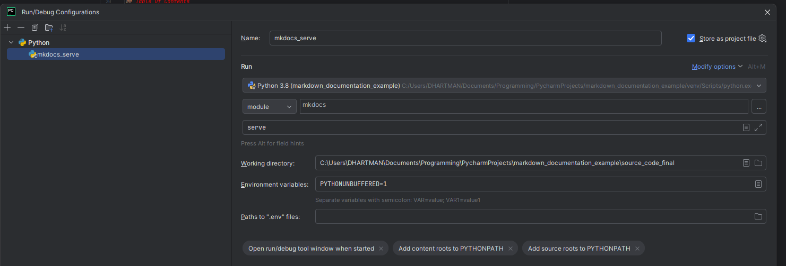

# Automating The creation of Documentation

The repo includes utilities, tips, code, etc. that help create and maintain various types of documentation.  This includes the following:

* Automate the creation of documentation based on data in various formats (Excel, Markdown, etc.)
* Automating the generation of diagrams (PlantUML, Mermaid, etc.)
* Converting from various types of documents (Markdown, rst, Excel, etc.)
* How to structure and manage data that can be utilized to automate the creation of documents
* Code (Python, bash, etc.) that creates various types of documentation.


[//]: # (TODO: Look into using sphinx and markdown components to create files.)


## python_mkdocs_example/

This folder contains the source code and an example documentation built with [MkDocs](https://www.mkdocs.org), using the [Material for MkDocs](https://github.com/squidfunk/mkdocs-material) theme and the [mkdocstrings](https://mkdocstrings.github.io) plugin for docstring code discovery.  The code used is intentionally kept basic and represents an unnecessary reproduction of fundamental math operations. This is done to keep the focus on _documenting_ a Python project, rather than the project's code.  You should be able to follow the same process and use the same concepts for your own Python project with more interesting code.

### Setup

To view the documentation project, navigate to `source_code_final/` and install the dependencies into a new virtual environment:

Why isn't the readme included in the git repo!?!?!?

**Linux, macOS:**

```bash
$ cd source_code_final
$ python3 -m venv venv
$ source venv/bin/activate
(venv) $ python -m pip install -r requirements.txt
```

**Windows:**

```powershell
PS> cd source_code_final
PS> python -m venv venv
PS> venv\bin\Activate.ps1
(venv) PS> python -m pip install -r requirements.txt
```

Once you're set up, and you've installed the dependencies, you can run the process to serve the project:

```bash
(venv) $ mkdocs serve
```

In PyCharm, a Run configuration can be created that will start the mkdocs server process.

The following settings are needed to create this run configuration:
Run: Choose the python interpreter to use to run mkdocs.  This python module needs to be included in the installed packages.
Module: mkdocs
Script Arguments: serve



Navigate to your localhost at port `8000` to view the generated documentation.

### Notes

Part of the documentation is auto-generated from docstrings in `source_code_final/calculator/`. The mkdocstrings package renders docstrings from module and package-level docstrings, as well as function docstrings in `calculations.py`.
You can find the relevant notation in `docs/index.md` and `docs/reference.md`.
The rest of the documentation is written in Markdown and split up across several files in the `docs/` directory.
In this project you can see that you can create project documentation that is partly auto-generated from your docstrings, interweaved with explanatory text and best-practice project documentation structure.

There is also an associated tutorial where you can learn how to [Build Your Python Project Documentation With MkDocs](https://realpython.com/python-project-documentation-with-mkdocs) step-by-step.

## [python_markdown](python_markdown/README.md)

Code to programmatically create Markdown documentation.

### [create_markdown.py](python_markdown/create_markdown.py)


### [python_markdown_creator.py](python_markdown/python_markdown_creator.py)

This is a compelete and working script that can be used to create a markdown file.  It could be copied into a new project to use
as a staring point/template.


## [markdown_output](markdown_output)

This directory is where created markdown files with be saved by default.  

The [full_example.md](markdown_output/full_example.md) file is a fairly complete example of a markdown file created using the MdUtils python library.
